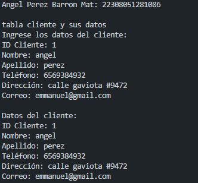
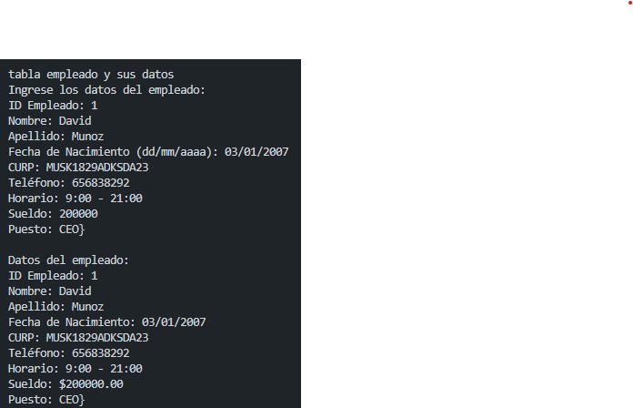
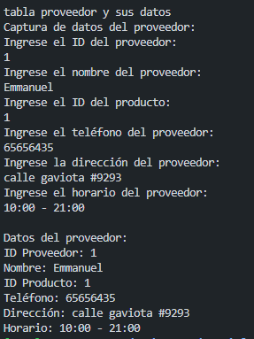

crear una clase cliente con 6 atributos (id_cliente, nombre, apellido, teléfono, dirección y correo), una función  captura() en la interfaz y otra mostrar datos(), crear la instancia y utilizar los atributos y llamadas a funciones lenguaje dart

crear una clase empleado con 9 atributos (id_empleado, nombre, apellido, fecha_nacimiento,curp, telefono, horario, sueldo, puesto), una función  captura() en la interfaz y otra mostrar datos(), crear la instancia y utilizar los atributos y llamadas a funciones lenguaje dart

crear una clase proveedor con 6 atributos (id_proveedor, nombre, id producto telefono direccion y horario), una función  captura() en la interfaz y otra mostrar datos(), crear la instancia y utilizar los atributos y llamadas a funciones lenguaje dart

