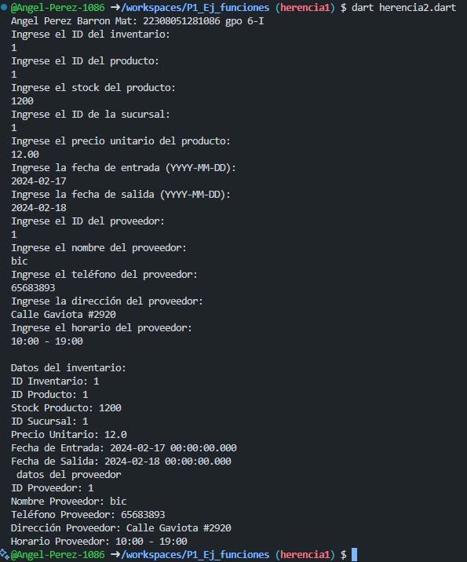

crear la clase inventario  con los atributos (id_inventario, id_producto stock_producto, id_sucursal, precio_unitario, fecha_ entrada y fecha_salida ) con una funcion capturadatos(), con interaccion de interfaz de usuario, crear la clase  Datosproveedores con herencia inventario con los atributos (id_proveedor, nombre, id_producto, telefono, direccion, horario) y una funcion  mostrarDatos(). y capturarDatos() lenguaje dart

